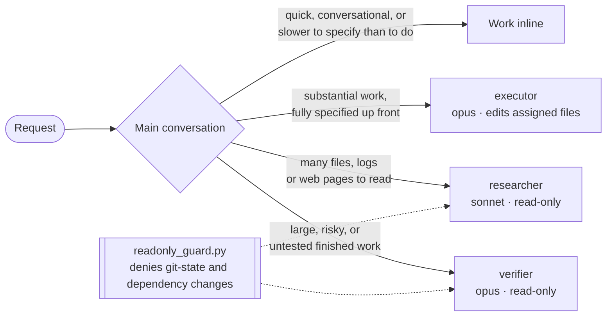

<div align="center">


# delegate

**Work inline. Delegate when a separate context pays for itself.**

[](https://github.com/kurcontko/delegate/actions/workflows/ci.yml)
[](LICENSE)
[](https://code.claude.com/docs/en/plugins)

</div>

A delegation policy for Claude Code's main conversation, plus three subagents it
can hand work to. The policy is not a pipeline: the main model works inline by
default, and most tasks need no agents. Nothing in it depends on which model
runs the main conversation, and it is not a bridge to another vendor's CLI.



| Agent | Does | Model, effort | Tools |
| --- | --- | --- | --- |
| `executor` | Implements one self-contained unit end to end inside assigned files | `opus`, high | Read, Grep, Glob, Bash, PowerShell, Edit, Write |
| `researcher` | Answers one high-volume research question with evidence | `sonnet`, high | Everything except Edit, Write, NotebookEdit, Agent (MCP tools included) |
| `verifier` | Independently checks completed work; returns a verdict | `opus`, high | Read, Grep, Glob, Bash, PowerShell |

The policy itself is one short file: [`rules/orchestration.md`](rules/orchestration.md).

## Install

Needs Claude Code v2.1.251 or later.

**As a plugin** (recommended). Agents are namespaced as `delegate:executor` and
so on, and the read-only guard comes with it:

```
/plugin marketplace add kurcontko/delegate
/plugin install delegate@delegate
```

**As plain files.** Copies the agents to `~/.claude/agents/` and the policy to
`~/.claude/rules/`, for every project, without touching any `CLAUDE.md`:

```sh
git clone https://github.com/kurcontko/delegate
./delegate/install.sh              # re-run to update
./delegate/install.sh --uninstall
```

The installer tracks what it wrote in `~/.claude/.delegate-manifest`. It refuses
to replace a file it did not write or one you edited since (`--force`
overrides), and `--uninstall` removes only files that still match. An install
made under the old name, fable-orchestrator, is picked up and moved over. This
route does not install the guard hook; see
[the guard notes](docs/readonly-guard.md) to add it yourself.

For one project only, copy `agents/*.md` to `.claude/agents/` and
`rules/orchestration.md` to `.claude/rules/` in that repo.

## Check that it works

- `/context` lists the three agents under Custom Agents.
- While a worker runs, `/tasks` shows the model and effort it runs on.

## The read-only guard

`researcher` and `verifier` have no edit tools but keep a shell, because a
verifier has to run tests and a researcher has to read git history. A
`PreToolUse` hook, `scripts/readonly_guard.py`, checks every shell command from
those two agents:

- **Git is an allow list.** Read-only subcommands (`status`, `log`, `diff`,
  `show`, `blame`, …) run; everything else, including `fetch`, `-c` settings
  that make git run a program, and anything the guard has never heard of, is
  denied. `gh` gets the same treatment: listing and viewing only.
- **Dependency changes are denied** (`npm install`, `pip install`,
  `cargo add`, `go get`, …), also through `uv run`, `npx` and the like. Test
  runners are left alone.
- **Indirection is followed or denied.** `bash -c`, `eval`, `find -exec`,
  `xargs`, `sudo`, comments and shell keywords are looked through; a shell
  fed from stdin, a command name that is a variable, schedulers like `at`, and
  `PATH`- or `GIT_*`-style variables that redirect execution are denied.
- **It is not a sandbox.** File writes, interpreters (`python -c`), scripts,
  build tools and a hostile repository config cannot be told apart from
  legitimate work by reading a command line, so for those the rule remains an
  instruction.
- **It fails open** if `python3` is missing, and is best-effort on Windows.

The main conversation and the `executor` are never affected. Details, limits,
and the hook snippet for plain-file installs: [docs/readonly-guard.md](docs/readonly-guard.md).

## Tune it

- `maxTurns` (150 for the executor, 80 for the others) stops a runaway worker.
  Its output comes back marked partial and the main conversation can resume it.
- `effort` in an agent's frontmatter overrides the session's effort level, so
  workers run at `high` even when the session runs lower. Drop the researcher
  to `medium` to cap cost; it will search less.
- The executor and verifier run on `opus`. To cap cost, lower their `effort`
  to `medium` before switching `model` to `sonnet`: on long coding tasks a
  stronger model at lower effort tends to cost less per finished task than a
  weaker one at `high`.
- An agent's `model` field beats `CLAUDE_CODE_SUBAGENT_MODEL`. Workers leave
  their configured model only if you set `CLAUDE_CODE_SUBAGENT_MODEL_FORCE=1`
  or your organization's `availableModels` allowlist blocks it. `opus` and
  `sonnet` are aliases, so each follows the current model of that tier.
- To keep MCP tools away from the researcher, replace its `disallowedTools`
  line with `tools: Read, Grep, Glob, Bash, PowerShell, WebSearch, WebFetch`.
- The plugin sets no `version`, so installs track the latest commit.

## Evals

`evals/` holds a small `claude plugin eval` suite (needs v2.1.269) that compares
sessions with and without the plugin: quick requests stay inline, high-volume
research goes to the researcher, assessments leave every file untouched, and an
executor hand-off carries a complete packet. Every run is a real model call on
your account. What is covered, what is not, and how to run it:
[docs/evals.md](docs/evals.md).
